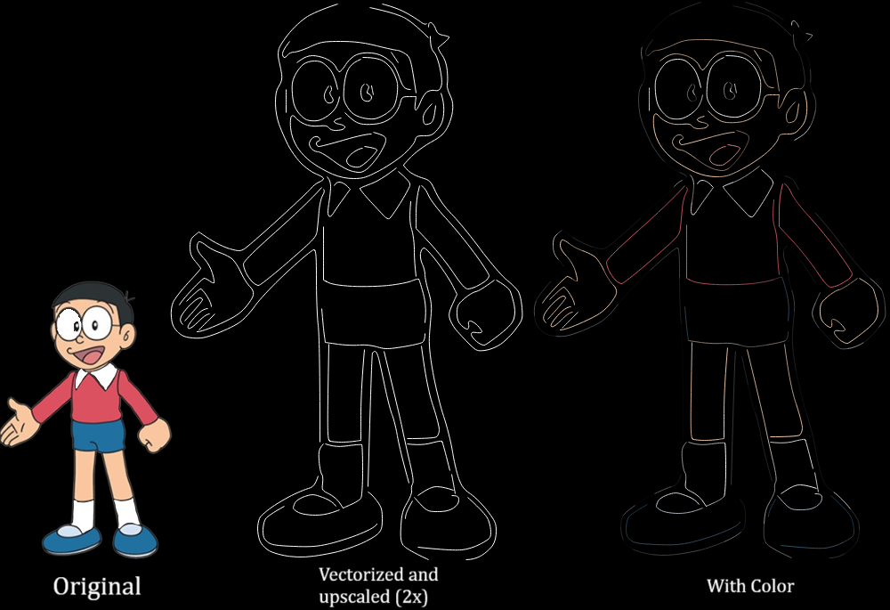
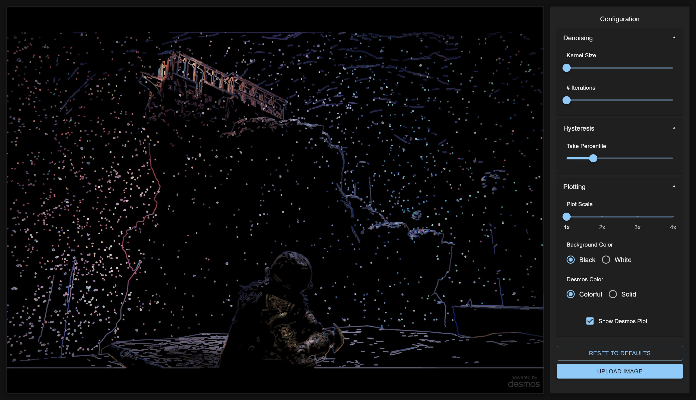

# Vektor

An image vectorizer algorithm created using Canny Edge Detection and [potrace](https://potrace.sourceforge.net/).

## Usage

```./vektor <input> [-s <scale>] [-o <output>] [-c]```

Use ``` -c ``` for colored output.

## Sample



## Frontend


